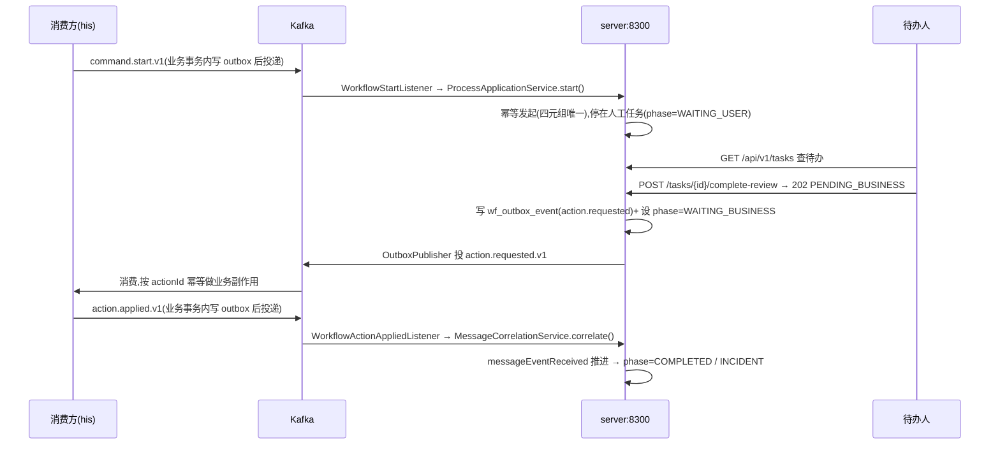

# workflow-platform 架构与能力参考

> 面向**中台开发者/运维**的内部设计参考:模块职责、可靠消息与幂等、流程生命周期、数据模型、鉴权、可观测性、运维 REST API。
> 消费方接入契约见 [`integration-guide.md`](integration-guide.md);部署/运维手册见 [`../deploy/README.md`](../deploy/README.md);路线图见 [`ROADMAP.md`](ROADMAP.md)。
> 本文所有事实性描述以对应源码为唯一真值源;涉及的类/资源均标注了所在模块。

## 1. 架构模式

**中台编排(Flowable)+ 消费方 outbox 发起 + 中台请求业务落实人工决定 + 消费方回执**,跨系统**最终一致**。

- 中台只存**流程状态 + businessKey 关联**,业务数据仍留在业务系统。
- **发起 / 落地回执走 Kafka**(与业务写库同事务),**查询 / 办理走 REST/SDK**(需即时反馈)。
- 办理 = "已受理"而非"已完成":`complete-review` 恒返回 **202 `PENDING_BUSINESS`**,业务落地异步最终一致。

### 端到端时序(审方为例)

## 2. 模块职责

| 模块 | 职责 | 关键类 / 资源(相对各模块 `src/main`) |
|---|---|---|
| **protocol** | Published Language:对外事件契约 record + REST DTO + 主题常量。无业务逻辑,可独立编译。`ProtocolInfo.CONTRACT_VERSION=1` | `event/EventEnvelopeV1`、`StartProcessCommandV1`、`WorkflowActionRequestedV1`、`WorkflowActionAppliedV1`、`WorkflowActionStatus`、`Actor`、`WorkflowTopics`、`WorkflowLifecycleV1`;`api/TaskView`、`TaskSearchResult`、`CompleteReviewRequest`、`ProcessInstanceView`、`TimelineEntry` |
| **core** | 领域/应用服务 + 数据访问 + Flyway 迁移 + 试点 BPMN。直接用 Flowable `RuntimeService`/`TaskService`(不抽象引擎,ADR 决策) | `process/ProcessApplicationService`、`process/ProcessQueryService`、`task/TaskApplicationService`、`correlation/MessageCorrelationService`、`outbox/OutboxEventRepository`、`inbox/InboxEventRepository`、`dlq/DlqEventRepository`、`link/ProcessLink(Repository)`+`ProcessPhase`、`delegate/RxReviewActionOutboxDelegate`、`db/migration/V1__…、V2__…`、`bpmn/his-rx-review-v1.bpmn20.xml` |
| **sdk** | 消费方接入门面(Spring Boot Starter)。默认 `workflow.client.enabled=false` → 注入 `NoopWorkflowClient`(引入即安全) | `WorkflowClient`、`RemoteWorkflowClient`、`NoopWorkflowClient`、`WorkflowClientProperties`、`WorkflowSdkAutoConfiguration` |
| **server(:8300)** | **运行时服务**:Flowable 引擎(async executor 开)+ REST + Kafka 监听 + outbox 投递 + 安全 + 指标/审计 | `web/*Controller`、`kafka/WorkflowStartListener`+`WorkflowActionAppliedListener`+`WorkflowDlqListener`+`EnvelopeCodec`+`KafkaErrorConfig`、`outbox/OutboxPublisher`、`correlation/CorrelationRetryJob`、`dlq/DlqReplayService`、`security/*`、`metrics/WorkflowMetrics`、`audit/WorkflowAudit`、`admin/*Service+*View`、`BpmnAutoDeployer`、`config/FlowableTuningConfig` |
| **admin(:8301)** | 定义/租户管理服务;`async-executor-activate=false`(不跑运行时作业),与 server 同库。扫 `com.lrj.workflow` 复用 core | `WorkflowPlatformAdminApplication` |

> **实现落位说明**:运维/定义部署的 REST(`/api/v1/admin/**`)当前实现于 **server** 模块(`AdminOpsController`/`AdminDefinitionController`/`DlqController` + `admin/*Service`),而非 `admin` 模块。`admin` 目前是独立进程骨架。

## 3. 运行时拓扑

| 服务 | 端口 | Flowable async executor | 角色 |
|---|---|---|---|
| workflow-platform-server | 8300 | **开**(`async-executor-activate=true`) | 承载运行时:REST、Kafka 监听、outbox 投递、驱动 timer/异步作业 |
| workflow-platform-admin | 8301 | **关** | 定义/租户管理;`check-process-definitions=false` |

两者连**同一 PostgreSQL**(`ACT_*` + `wf_*`)与同一 Kafka broker。server 无状态,可多副本水平扩展(正确性机制见 §4、[`deploy/README.md`](../deploy/README.md) HA 章)。

BPMN 部署:server 启动经 `BpmnAutoDeployer` 部署试点 `hisRxReview`(tenant=`his`,`enableDuplicateFiltering` 去重,`workflow.pilot.auto-deploy=false` 可关);运行时新定义经 `/api/v1/admin/definitions/deploy` 部署。

## 4. 可靠消息与幂等(正确性核心)

### 4.1 事务性 Outbox(至少一次投递)

- 业务/流程副作用与 `wf_outbox_event` 写在**同一 PG 事务**;`OutboxPublisher`(server,`@Scheduled(fixedDelay=workflow.outbox.poll-ms)`)后台领取投递。
- 领取用 `claimBatch(...)`(`FOR UPDATE SKIP LOCKED` + `lease_owner`/`lease_until` 租约),多副本各领不相交批次;发送成功 `markSent`,失败 `reschedule` 退避重投(至少一次)。
- `wf_outbox_event.status`:`READY → PROCESSING → SENT`(失败 `FAILED`/退避重排)。

### 4.2 Inbox 去重(至少一次收敛为幂等)

- 入站事件按 `EventEnvelopeV1.eventId` 落 `wf_inbox_event` 主键去重(`WorkflowStartListener`/`WorkflowActionAppliedListener`)。
- `wf_inbox_event.status`:`RECEIVED / PROCESSING / DONE / WAITING_CORRELATION / FAILED`;`payload` 保留原始 JSON,供 `WAITING_CORRELATION` 重放。

### 4.3 三层幂等

| 层 | 键 | 作用 | 落点 |
|---|---|---|---|
| ① 收件箱 | `eventId` | 同一事件重复投递去重 | `wf_inbox_event`(主键) |
| ② 业务副作用 | `actionId` | 消费方侧副作用去重 | 消费方自行实现 |
| ③ 发起 | `(tenantId, processDefinitionKey, businessKey, idempotencyKey)` | 重复发起返回原实例 | `wf_process_link` 唯一约束 `uk_wf_link_idem` |

**并发发起收敛**(`ProcessApplicationService.start`):幂等快路径未命中时,起 Flowable 实例 + 插 `wf_process_link` 放同一事务;并发同 `idempotencyKey` 者插入触发 `DuplicateKeyException` → 事务回滚(连带撤销 Flowable start)→ 重读返回赢家。同 `businessKey` 已有 `WAITING_USER` 的另一 cycle 被偏唯一索引 `uk_wf_link_waiting_user` 拒绝 → 抛 `WorkflowConflictException`(409)。

### 4.4 ACK 关联(落地回执推进流程)

`MessageCorrelationService.correlate(applied)` 依次校验:实例仍在运行 → 流程变量 `actionId` 与回执匹配 → message 订阅(`hisRxReviewApplied`)就绪,再 `messageEventReceived` 推进,并按结果更新 `phase`。结果枚举 `Outcome`:

| Outcome | 含义 | 处理 |
|---|---|---|
| `CORRELATED` | 关联成功并推进 | phase → `COMPLETED` / `WAITING_BUSINESS` / `INCIDENT`(据实例/任务状态) |
| `WAITING_SUBSCRIPTION` | 回执早到(订阅未就绪) | inbox 置 `WAITING_CORRELATION`,`CorrelationRetryJob`(server)重试重放,不丢弃 |
| `INSTANCE_GONE` | 实例已不在运行 | 视为已处理 |
| `ACTION_MISMATCH` | `actionId` 不匹配 | 告警(异常路径) |

## 5. 流程生命周期(`ProcessPhase`)

`wf_process_link.phase` 记录中台侧阶段(枚举 `com.lrj.workflow.core.link.ProcessPhase`):

| phase | 含义 |
|---|---|
| `WAITING_USER` | 等人工节点办理(同 businessKey 最多一个,偏唯一索引保证) |
| `WAITING_BUSINESS` | 人工已决定、等业务系统落地 ACK(不阻塞同 businessKey 的新 cycle) |
| `COMPLETED` | 流程正常结束 |
| `CANCELLED` | 被取消 |
| `INCIDENT` | 进入人工处置(未落地/异常) |

`ProcessInstanceView.phase` 对外暴露同一枚举,前端据此诚实呈现"处理中 → 已落地 / 异常"。

## 6. 数据模型(`wf_*`,Flyway 管理)

平台自有表由 Flyway 版本化(`core/db/migration/V*.sql`),与 Flowable 自建的 `ACT_*` 分离管理(见 [ADR 0001](adr/0001-flowable-version-and-schema.md))。

| 表 | 用途 | 关键约束 |
|---|---|---|
| `wf_process_link` | 幂等发起 ↔ Flowable 实例 + businessKey 绑定 + phase | `uk_wf_link_idem`(四元组唯一)、`uk_wf_link_waiting_user`(同 businessKey 单 WAITING_USER 偏唯一) |
| `wf_inbox_event` | 入站去重 + 关联重试重放 | 主键 `event_id` |
| `wf_outbox_event` | 事务性发件箱 + 租约领取 | `status`/`available_at` 索引;`lease_owner`/`lease_until` |
| `wf_dlq_event` | 死信落库(排查/重放) | `status` = `NEW`/`REPLAYED`;记 `original_topic` 供重放投回 |
| `wf_task_authz_sync` | 任务授权同步态(PENDING fail-closed) | 主键 `task_id` |
| `wf_deployment_audit` | 流程定义部署/挂起/恢复审计 | `action` = `DEPLOY`/`SUSPEND`/`ACTIVATE` |
| `wf_tenant_config` | 租户配置(启用定义、authz 三态、候选组映射、留存) | 主键 `tenant_id` |

## 7. 鉴权(Casdoor JWT,开关渐进)

由 `workflow.security.enabled` 二选一装配安全过滤链(`server/security/SecurityConfig`),恰有一个 `SecurityFilterChain` 生效:

- **`false`(默认)**:全放行,保 dev/shadow 联调(明文 `X-Workflow-Tenant` 头路径),`actor` 取请求体。
- **`true`**:OAuth2 Resource Server 校验 Casdoor JWT。`/actuator/health|info|prometheus` 放行;`/api/v1/admin/**` 与 `/api/v1/dlq/**` 需 **`ADMIN`** 权限;其余 `/api/**` 需已认证。`actor`/`tenant` 由 JWT 派生并覆盖请求体/头(防伪造)。

JWT `groups` claim 经 `normalizeGroup()`(取路径末段、去 `<org>_` 前缀、大写)归一化为权限,与前端 `normalizeGroup` 及 BPMN `candidateGroups`(`PHARMACIST`/`ADMIN`)对齐。JWT 解码优先 `jwk-set-uri`(lazy 不阻塞启动),否则 `issuer-uri`。配置见 [接入指南 §4.3](integration-guide.md) 与 `application.yml` 的 `workflow.security.*`。

> Casdoor JWT(含 groups)约 9KB,故 server 设 `max-http-request-header-size: 64KB`,避免合法 token 触发 400。

## 8. 可观测性

- **Prometheus 指标**(`server/metrics/WorkflowMetrics`,micrometer → `/actuator/prometheus`;点分名转下划线 + `_total`):
  `workflow_process_started_total`、`workflow_review_completed_total`、`workflow_action_applied_total`、`workflow_correlation_outcome_total`、`workflow_dlq_landed_total`、`workflow_dlq_replayed_total`、`workflow_deadletter_retried_total`、`workflow_admin_op_total`。埋点在 server 层 listener/controller/service,不侵入 core。
- **结构化审计**(`server/audit/WorkflowAudit`):独立 logger `WORKFLOW_AUDIT`(key=value),记审方完成、任务操作(claim/reassign/delegate/unclaim)、运维干预、DLQ 重放。
- **生命周期事件**:server best-effort 投 `workflow.lifecycle.v1`(`WorkflowLifecycleV1`,STARTED/COMPLETED/INCIDENT),供看板/观察者订阅——**不参与正确性**。
- **告警规则**:`deploy/prometheus/alerts.yml`(DLQ 落地、关联不匹配、终态失败、驳回率、server down)。

## 9. 运维 / 管理 REST API 参考

> 运维/管理端点(operator-facing)。鉴权启用时 `/api/v1/admin/**`、`/api/v1/dlq/**` 需 **ADMIN**。消费方业务接口(tasks/process-instances/definitions)见 [接入指南 §4.2](integration-guide.md)。前端运维界面见 [console README](../workflow-console/README.md) 的 `/ops`、`/designer`。

### 9.1 实例运维 · `/api/v1/admin`(`AdminOpsController`)

| 方法 | 路径 | 说明 |
|---|---|---|
| GET | `/instances?definitionKey=&phase=&limit=100` | 按 phase/definition 查实例 → `ProcessInstanceView[]` |
| GET | `/incidents?limit=100` | INCIDENT 实例列表 |
| POST | `/instances/{id}/suspend` \| `/activate` | 挂起 / 恢复实例 → 204 |
| POST | `/instances/{id}/terminate?reason=` | 终止实例(reason 建议必填)→ 204 |
| GET | `/jobs/dead-letter?limit=100` | Flowable 死信作业列表 → `DeadLetterJobView[]` |
| POST | `/jobs/{jobId}/retry?retries=3` | 重置死信作业重试次数 → 204 |

### 9.2 死信(Kafka DLQ)· `/api/v1/dlq`(`DlqController`)

| 方法 | 路径 | 说明 |
|---|---|---|
| GET | `/?status=NEW&limit=100` | 列死信记录 → `DlqRecord[]` |
| POST | `/{id}/replay` | 单条重放(投回 `original_topic`,由原监听幂等消费);不存在/已重放 → 404 |
| POST | `/replay-all` | 批量重放 `NEW` → `{replayed: n}` |

### 9.3 流程定义管理 · `/api/v1/admin/definitions`(`AdminDefinitionController`)

| 方法 | 路径 | 说明 |
|---|---|---|
| GET | `/`(带 `X-Workflow-Tenant`) | 列该租户流程定义 → `ProcessDefinitionView[]` |
| POST | `/deploy` | body `{name, bpmnXml}` 部署 BPMN 2.0 XML;记 `wf_deployment_audit` → `ProcessDefinitionView` |
| POST | `/{id}/suspend` \| `/activate` | 挂起 / 恢复定义 → 204 |

> `/deploy` 是前端「粘贴 XML 部署」与可视化设计器 `/designer` 的共用后端(零后端改动即支撑设计器)。

## 10. 试点流程:`hisRxReview`(审方)

- 定义:`core/src/main/resources/bpmn/his-rx-review-v1.bpmn20.xml`(tenant=`his`),server 启动自动部署。
- 人工任务候选组 `PHARMACIST`;网关按流程变量 `decision`(`PASS`/`REJECT`)分支。
- 请求落地经 `RxReviewActionOutboxDelegate`(core)写 outbox(`action.requested.v1`);业务 ACK 经 message `hisRxReviewApplied` 关联推进。
- **设计器边界**:可视化设计器是"可视化编辑+部署工具",产物无法从 console 独立跑实例——发起归消费方 Kafka,完成走审方端点,condition 仅 `decision` 变量可用。详见 [ROADMAP §4.4](ROADMAP.md) 与 `docs/plans/bpmn-designer-0815-2120/`。

## 11. 相关文档

- 消费方接入契约:[`integration-guide.md`](integration-guide.md)
- 新流程接入配方:[`onboarding-new-process.md`](onboarding-new-process.md)
- 部署 / HA / 监控:[`../deploy/README.md`](../deploy/README.md)
- 前端管控台:[`../workflow-console/README.md`](../workflow-console/README.md)
- 版本 / schema 决策:[`adr/0001-flowable-version-and-schema.md`](adr/0001-flowable-version-and-schema.md)
- 路线图:[`ROADMAP.md`](ROADMAP.md)
