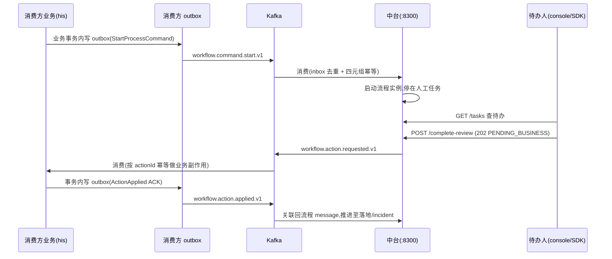

# 工作流中台接入指南

> 面向**消费方业务系统**（如 his-platform）接入 `workflow-platform` 流程/审批中台。
> 契约主版本 `CONTRACT_VERSION = 1`（见 `workflow-platform-protocol` 的 `ProtocolInfo`）。
> 本文所有契约字段以 `workflow-platform-protocol` 的 record 为唯一真值源。

## 1. 设计原则

- **中台 + SDK 同构**：与 auth-platform 一致——中台承载流程编排（Flowable），消费方通过 SDK / Kafka 接入，不感知 Flowable 内部类型。
- **发起与落地走 Kafka（事务性、最终一致）**：发起流程、业务落地回执**必须**走消费方自己的 **outbox → Kafka**，与业务写库同事务；**不走 SDK**。
- **查询与办理走 SDK / REST（需即时反馈）**：查待办、办理（通过/驳回）需要同步结果，走 SDK 或 REST。
- **办理是"已受理"而非"已完成"**：办理返回 `202 PENDING_BUSINESS`，人工决定已受理，业务落地经 Kafka 异步最终一致，UI/调用方**不得**呈现为"已完成"。
- **三层幂等**：`EventEnvelopeV1.eventId`（收件箱去重）→ 业务 `actionId`（副作用去重）→ 发起四元组 `(tenantId, processDefinitionKey, businessKey, idempotencyKey)`。
- **租户显式传递**：REST 带 `X-Workflow-Tenant` 头；事件带 `EventEnvelopeV1.tenantId`。

## 2. 接入平面总览

| 平面 | 通道 | 用途 | 走 SDK? |
|---|---|---|---|
| ① 异步事件 | Kafka | **发起流程** + **业务落地回执** | ❌ 走消费方 outbox |
| ② 同步接口 | REST(:8300) / SDK | 查待办、办理(通过/驳回)、查实例/轨迹/定义 XML | ✅ 可选 SDK |
| ③ 待办 UI | workflow-console | 人工待办中心 + 流程轨迹（可选，或自建） | — |

### 端到端时序（审方为例）



## 3. 平面①：Kafka 事件契约

主题常量见 `WorkflowTopics`。事件统一序列化为 **JSON 字符串**，外层包 `EventEnvelopeV1<T>` 信封；消息 **key 一律 `tenant|definition|businessKey`**。

| Topic | 方向 | 载荷 record |
|---|---|---|
| `workflow.command.start.v1` | 消费方 → 中台 | `StartProcessCommandV1` |
| `workflow.action.requested.v1` | 中台 → 消费方 | `WorkflowActionRequestedV1` |
| `workflow.action.applied.v1` | 消费方 → 中台 | `WorkflowActionAppliedV1` |
| `workflow.lifecycle.v1` | 中台 → 观察者 | 生命周期通知（不参与正确性） |
| `workflow.dlq.v1` | 双侧运维 | 毒消息 / 超限失败 |

### 信封 `EventEnvelopeV1<T>`

```
eventId(UUID,inbox 去重键) · contractVersion(固定 1) · eventType · occurredAt
· source(来源系统标识) · tenantId · correlationId · causationId(上游 eventId,可空) · payload
```

### ① 发起 `StartProcessCommandV1`（消费方 → 中台）

```
processDefinitionKey  流程定义 key(如 hisRxReview)
businessKey           业务键(审方=encounterId)
idempotencyKey        幂等键(审方=review cycle id)
initiator             发起人主体(Casdoor sub 或服务标识)
variables             初始流程变量(仅 JSON scalar/受控 list/map,白名单:IDs/枚举/金额快照/actor 快照;禁整对象)
```
中台按 `(tenantId, processDefinitionKey, businessKey, idempotencyKey)` 四元组去重，重复发起返回原实例；至少一次投递安全。

### ② 请求落地 `WorkflowActionRequestedV1`（中台 → 消费方）

```
processInstanceId · taskId · taskDefinitionKey(如 pharmacistReview) · processDefinitionKey
· businessKey · actionId(业务侧幂等键) · action(如 RX_REVIEW_PASS/RX_REVIEW_REJECT)
· actor(办理人快照) · parameters(如审方意见 opinion)
```
消费方**按 `actionId` 幂等**做业务副作用（在 `eventId` 收件箱去重之上再收敛一层）。

### ③ 落地回执 `WorkflowActionAppliedV1`（消费方 → 中台）

```
processInstanceId · taskId(落地时任务可能已结束,可空) · processDefinitionKey · businessKey
· actionId(对应 requested 的 actionId) · status · businessVersion(可空) · errorCode/errorMessage(可空)
```

`status`（`WorkflowActionStatus`）语义：

| 值 | 含义 | 流程走向 |
|---|---|---|
| `APPLIED` | 业务已成功落地 | 推进至完成 |
| `REJECTED_BY_BUSINESS` | 业务规则拒绝（非重试） | 走人工处置分支 |
| `FAILED_RETRYABLE` | 可重试失败 | 消费方 outbox 重发 |
| `FAILED_FINAL` | 终态失败 | 进 incident / 人工处置，流程不自动通过 |

### `Actor` 快照

```
subjectId   Casdoor sub(授权主体,唯一授权真相)
username    登录名(业务侧回查本地数值 id 用)
displayName 展示名,可空
```

## 4. 平面②：SDK / REST

### 4.1 引入 SDK（Spring Boot Starter）

```xml
<dependency>
  <groupId>com.lrj.workflow</groupId>
  <artifactId>workflow-platform-sdk</artifactId>
  <version>0.1.0-SNAPSHOT</version>
</dependency>
```
> SDK 已传递依赖 `workflow-platform-protocol`，消费方可直接复用其 record 做事件序列化。

```yaml
workflow:
  client:
    enabled: true                       # 默认 false → 注入 NoopWorkflowClient(引入即安全,不开不走远程)
    base-url: http://workflow-server:8300
    connect-timeout-ms: 2000
    read-timeout-ms: 5000
```
自动装配（`WorkflowSdkAutoConfiguration`）后注入 `WorkflowClient`：

```java
public interface WorkflowClient {
    List<TaskView> findTasks(String tenant, String definitionKey, String businessKey);
    String completeReview(String tenant, String taskId, CompleteReviewRequest request); // 返回 actionId
}
```
> 发起故意**不在** SDK 里——发起必须与业务写库同事务，走 outbox（见 §5）。

### 4.2 直接调 REST（不引 SDK）

所有请求带头 `X-Workflow-Tenant: <租户>`（如 `his`）。

| 方法 | 路径 | 说明 |
|---|---|---|
| GET | `/api/v1/tasks?definitionKey=&businessKey=` | 查活动待办 → `TaskView[]` |
| GET | `/api/v1/tasks/search?definitionKey=&businessKey=&candidateGroup=&page=&size=` | 候选组过滤 + 分页 → `TaskSearchResult` |
| POST | `/api/v1/tasks/{taskId}/complete-review` | 办理，body `CompleteReviewRequest` → **202** `{actionId, status:"PENDING_BUSINESS"}`；冲突 409 |
| GET | `/api/v1/process-instances?definitionKey=&businessKey=` | 查实例（含最终一致 `phase`）→ `ProcessInstanceView[]` |
| GET | `/api/v1/process-instances/{id}/timeline` | 历史轨迹 → `TimelineEntry[]` |
| GET | `/api/v1/definitions/{key}/xml` | 最新版 BPMN XML（含 DI，供 bpmn-js 渲染） |

`phase`（`ProcessInstanceView.phase`）：`WAITING_USER` / `WAITING_BUSINESS` / `COMPLETED` / `INCIDENT` / `CANCELLED`。

### 4.3 服务端鉴权（与 `X-Workflow-Tenant` 的关系）

REST 层鉴权由 `workflow.security.enabled` 开关分期（与前端 `VITE_AUTH_ENABLED` 对齐）:

| 阶段 | `enabled` | 调用方式 | tenant / actor 来源 |
|---|---|---|---|
| dev / shadow | `false`(默认) | 仅带 `X-Workflow-Tenant` 头 | 头 + 请求体 `actor*`(可信身份由消费方保证) |
| 生产 | `true` | **额外带 `Authorization: Bearer <Casdoor JWT>`** | **从 JWT 派生并覆盖**头/请求体(防伪造);未认证→401 |

启用后:
- `/actuator/health|info|prometheus` 放行,其余 `/api/**` 需有效 JWT。
- JWT 的 `groups` claim 经归一化(取路径末段、去 `<org>_` 前缀、大写)作为权限,与 BPMN candidateGroups(`PHARMACIST`/`ADMIN`)对齐。
- `actor` 由 JWT 的 `sub`/`preferred_username`/`name` 派生,**覆盖请求体传入的 `actorSub` 等**(请求体 actor 仅在 `enabled=false` 生效)。
- `tenant`:仅当配置了 `workflow.security.tenant-claim` 且 JWT 含该 claim 时从 JWT 取,否则仍用 `X-Workflow-Tenant` 头(不臆造 Casdoor 租户映射)。

**服务端配置**(环境变量):

| 配置(`workflow.security.*`) | 环境变量 | 说明 |
|---|---|---|
| `enabled` | `WORKFLOW_SECURITY_ENABLED` | 默认 false;生产 true |
| `jwk-set-uri` | `WORKFLOW_OIDC_JWKS` | Casdoor JWKS(优先,lazy 不阻塞启动) |
| `issuer-uri` | `WORKFLOW_OIDC_ISSUER` | 或用 issuer(启动拉 openid-config);与 jwks 二选一 |
| `groups-claim` | `WORKFLOW_GROUPS_CLAIM` | 承载组的 claim,默认 `groups` |
| `tenant-claim` | `WORKFLOW_TENANT_CLAIM` | 承载租户的 claim;空=仍取头 |

> ⚠️ **SDK 现状**:`RemoteWorkflowClient` 暂未自动附带 `Authorization`(服务间鉴权待补,见 ROADMAP 阶段一)。因此在 `enabled=true` 环境下,消费方经 SDK 调用需自行注入服务令牌,或经带鉴权的网关转发;`enabled=false` 的联调环境不受影响。

## 5. 消费方代码骨架（示意）

> 以下为**示意骨架**，字段以 protocol record 为准；消费方复用 `workflow-platform-protocol` 的 record + Jackson 即可。

### 5.1 发起（业务事务内写 outbox）

```java
// 在你的业务写库同一事务里,把 EventEnvelopeV1<StartProcessCommandV1> 序列化后写入你自己的 outbox 表。
var cmd = new StartProcessCommandV1(
        "hisRxReview",                 // processDefinitionKey
        encounterId,                   // businessKey
        reviewCycleId,                 // idempotencyKey
        currentUserSub,                // initiator
        Map.of("encounterId", encounterId, "amount", amountSnapshot)); // 白名单变量
var env = new EventEnvelopeV1<>(
        UUID.randomUUID().toString(), 1, "workflow.command.start.v1",
        Instant.now(), "his-outpatient", tenant, correlationId, null, cmd);
outbox.save(topic("workflow.command.start.v1"),
            key(tenant, "hisRxReview", encounterId), json(env)); // 你的 outbox 轮询器再投 Kafka
```

### 5.2 落地（消费 requested → 做业务 → 回 applied）

```java
@KafkaListener(topics = "workflow.action.requested.v1", groupId = "his-outpatient") // 用你自己的 group
public void onActionRequested(String message) {
    EventEnvelopeV1<WorkflowActionRequestedV1> env = codec.parse(message, WorkflowActionRequestedV1.class);
    if (!inbox.tryClaim(env.eventId())) return;         // ① eventId 收件箱去重
    var req = env.payload();
    // ② 按 actionId 幂等做业务副作用(例:按 action=RX_REVIEW_PASS 放行发药 / REJECT 退回医生)
    WorkflowActionStatus status = applyBusiness(req.actionId(), req.action(), req.parameters());
    // ③ 事务内写 outbox 回执
    var applied = new WorkflowActionAppliedV1(
            req.processInstanceId(), req.taskId(), req.processDefinitionKey(), req.businessKey(),
            req.actionId(), status, businessVersion, null, null);
    var out = new EventEnvelopeV1<>(UUID.randomUUID().toString(), 1, "workflow.action.applied.v1",
            Instant.now(), "his-outpatient", env.tenantId(), env.correlationId(), env.eventId(), applied);
    outbox.save("workflow.action.applied.v1", key(env.tenantId(), req.processDefinitionKey(), req.businessKey()), json(out));
    inbox.markDone(env.eventId());
}
```

## 6. 接入 checklist

**中台侧（一次性）**
- [ ] 为该业务设计并部署一份 BPMN 流程定义（如 `hisRxReview`），含 BPMNDI 图形段（供 console 渲染）。
- [ ] 约定 `action` 类型语义（如 `RX_REVIEW_PASS` / `RX_REVIEW_REJECT`）与候选组命名（大写无前缀，如 `PHARMACIST`）。
- [ ] 约定 `variables` 白名单。

**消费方侧**
- [ ] 引 `workflow-platform-sdk` 依赖（查询/办理即时反馈用；不需要可只引 `workflow-platform-protocol`）。
- [ ] **发起**：业务事务内写 outbox → `workflow.command.start.v1`（四元组幂等）。
- [ ] **落地**：消费 `workflow.action.requested.v1`（自有 group）→ 按 `actionId` 幂等做副作用 → 事务内写 outbox → `workflow.action.applied.v1`。
- [ ] 实现 inbox（按 `eventId` 去重）+ outbox（至少一次投递 + 重发）。
- [ ] 所有 REST 调用带 `X-Workflow-Tenant`；配 `workflow.client.*`（若用 SDK）。
- [ ] 生产环境(`workflow.security.enabled=true`):REST 调用额外带 `Authorization: Bearer <Casdoor JWT>`（见 §4.3）。
- [ ] 待办 UI：接 workflow-console，或自建接 REST。

## 7. 参考实现与约束

- **参考实现**：`his-platform` 审方场景（消费方适配器），是本中台的首个试点接入方。
- **契约演进**：`EventEnvelopeV1.contractVersion` 固定 `1`；破坏性变更走新版本 topic（`*.v2`），并行灰度。
- **现状约束**：
  - SDK/protocol 为 `0.1.0-SNAPSHOT`，**未发布到公共仓库**（构建产物在本地 maven 仓库 `/Users/liruijun/personal/repository`）；外部项目引依赖前需能访问该仓库或内网 Nexus。
  - Kafka topic/序列化/inbox-outbox 需消费方自行落实（中台侧参考 `workflow-platform-server` 的 `WorkflowStartListener` / `WorkflowActionAppliedListener` 与 `EnvelopeCodec`）。

## 8. 契约 record 速查

| 用途 | Record（`com.lrj.workflow.protocol.*`） |
|---|---|
| 事件信封 | `event.EventEnvelopeV1<T>` |
| 发起 | `event.StartProcessCommandV1` |
| 请求落地 | `event.WorkflowActionRequestedV1` |
| 落地回执 | `event.WorkflowActionAppliedV1` + `event.WorkflowActionStatus` |
| 办理人 | `event.Actor` |
| 主题常量 | `event.WorkflowTopics` |
| 待办视图 | `api.TaskView` / `api.TaskSearchResult` |
| 办理请求 | `api.CompleteReviewRequest` |
| 实例视图 | `api.ProcessInstanceView` |
| 轨迹条目 | `api.TimelineEntry` |

## 附录 A · Kafka 消息样例（可直接用）

序列化为 **JSON 字符串**（`String` value，非 Avro/JsonSerializer），字段名 camelCase、`occurredAt` 为 ISO-8601、枚举序列化为名字、`null` 字段保留。形状由 `ProtocolGoldenTest` 钉死，跨语言消费方可依赖这些字段名。

### A.1 发起 `workflow.command.start.v1`（消费方 → 中台）

```json
{
  "eventId": "3f9a1c2e-9b1a-4c7d-8e2f-1a2b3c4d5e6f",
  "contractVersion": 1,
  "eventType": "workflow.command.start.v1",
  "occurredAt": "2026-08-15T02:00:00Z",
  "source": "his-outpatient",
  "tenantId": "his",
  "correlationId": "corr-enc-90003",
  "causationId": null,
  "payload": {
    "processDefinitionKey": "hisRxReview",
    "businessKey": "90003",
    "idempotencyKey": "90003-cycle-1",
    "initiator": "his-outpatient",
    "variables": { "encounterId": 90003, "reviewRound": 1, "amount": 128.50 }
  }
}
```

### A.2 请求落地 `workflow.action.requested.v1`（中台 → 消费方）

```json
{
  "eventId": "7c2b6d41-2a55-4f0e-9b3c-0d1e2f3a4b5c",
  "contractVersion": 1,
  "eventType": "workflow.action.requested.v1",
  "occurredAt": "2026-08-15T02:05:00Z",
  "source": "workflow-server",
  "tenantId": "his",
  "correlationId": "corr-enc-90003",
  "causationId": "3f9a1c2e-9b1a-4c7d-8e2f-1a2b3c4d5e6f",
  "payload": {
    "processInstanceId": "1d308cae-9881-11f1-92be-8664eb1595db",
    "taskId": "1d31771a-9881-11f1-92be-8664eb1595db",
    "taskDefinitionKey": "pharmacistReview",
    "processDefinitionKey": "hisRxReview",
    "businessKey": "90003",
    "actionId": "act-9f3c1a20",
    "action": "RX_REVIEW_PASS",
    "actor": { "subjectId": "sub-123", "username": "pharma01", "displayName": "药师张三" },
    "parameters": { "opinion": "同意发药" }
  }
}
```

### A.3 落地回执 `workflow.action.applied.v1`（消费方 → 中台）

```json
{
  "eventId": "b81d7e90-6c34-4a12-8f5d-9e0a1b2c3d4e",
  "contractVersion": 1,
  "eventType": "workflow.action.applied.v1",
  "occurredAt": "2026-08-15T02:05:03Z",
  "source": "his-outpatient",
  "tenantId": "his",
  "correlationId": "corr-enc-90003",
  "causationId": "7c2b6d41-2a55-4f0e-9b3c-0d1e2f3a4b5c",
  "payload": {
    "processInstanceId": "1d308cae-9881-11f1-92be-8664eb1595db",
    "taskId": null,
    "processDefinitionKey": "hisRxReview",
    "businessKey": "90003",
    "actionId": "act-9f3c1a20",
    "status": "APPLIED",
    "businessVersion": 7,
    "errorCode": null,
    "errorMessage": null
  }
}
```
> 驳回场景：`payload.action` = `RX_REVIEW_REJECT`；业务规则拒绝时回执 `status` = `REJECTED_BY_BUSINESS`；可重试失败 `FAILED_RETRYABLE`（消费方 outbox 重发）；终态失败 `FAILED_FINAL`（进 incident）。

### A.4 手工投递测试（kafka-console-producer）

```bash
# 冒烟环境 Kafka 为 :9095(独立于其他项目的 :9092)。把上面的 JSON 存成单行文件再投:
cat start-cmd.json | tr -d '\n' | kafka-console-producer \
  --bootstrap-server localhost:9095 \
  --topic workflow.command.start.v1

# 生产环境用 key = tenant|definition|businessKey 保证同 businessKey 分区内有序:
#   --property parse.key=true --property key.separator=$'\t'
#   然后每行为:  his|hisRxReview|90003<TAB>{"eventId":...}
```
> 至少一次投递安全:中台先按 `eventId` inbox 去重,再按发起四元组幂等;重复投递不会重复启动流程。

## 附录 B · 把 SDK 发布到内网 Nexus

消费方要引 `workflow-platform-sdk` / `workflow-platform-protocol` 依赖,需先把制品发布到可访问的 Nexus。当前版本 `0.1.0-SNAPSHOT`、groupId `com.lrj.workflow`、Java 21。

### B.1 中台侧:配置发布仓库(root `pom.xml`)

```xml
<distributionManagement>
  <repository>
    <id>nexus-releases</id>
    <url>https://nexus.example.com/repository/maven-releases/</url>
  </repository>
  <snapshotRepository>
    <id>nexus-snapshots</id>
    <url>https://nexus.example.com/repository/maven-snapshots/</url>
  </snapshotRepository>
</distributionManagement>
```

`~/.m2/settings.xml` 配对应 `id` 的凭据(建议走环境变量,勿硬编码密码):

```xml
<servers>
  <server><id>nexus-releases</id><username>${env.NEXUS_USER}</username><password>${env.NEXUS_PASS}</password></server>
  <server><id>nexus-snapshots</id><username>${env.NEXUS_USER}</username><password>${env.NEXUS_PASS}</password></server>
</servers>
```

### B.2 发布制品

> 消费方只需 `protocol` + `sdk`(及父 pom);`server/core/admin` 无需外发。`-am` 会连带把它们依赖的父 pom / protocol 一起纳入。

```bash
export JAVA_HOME=$(/usr/libexec/java_home -v 21)

# A. 快速(当前 0.1.0-SNAPSHOT)→ 发到 snapshots 仓库
mvn -pl workflow-platform-protocol,workflow-platform-sdk -am deploy -DskipTests

# B. 正式 release(供外部稳定引用)→ 去掉 -SNAPSHOT 发到 releases,再回滚到下一个开发版本
mvn versions:set -DnewVersion=0.1.0
mvn -pl workflow-platform-protocol,workflow-platform-sdk -am deploy -DskipTests
mvn versions:set -DnewVersion=0.2.0-SNAPSHOT   # bump 回开发版
```

### B.3 消费方侧:配置解析仓库

在消费方 `~/.m2/settings.xml` 或其 `pom.xml` 指向 Nexus 聚合仓库(maven-public 通常聚合 releases+snapshots):

```xml
<repositories>
  <repository>
    <id>nexus-public</id>
    <url>https://nexus.example.com/repository/maven-public/</url>
    <releases><enabled>true</enabled></releases>
    <snapshots><enabled>true</enabled></snapshots>
  </repository>
</repositories>
```

之后即可正常 `mvn dependency:resolve` 拉到 `com.lrj.workflow:workflow-platform-sdk`。

> 过渡期(未上 Nexus 前):可让消费方共享同一台机器的本地 maven 仓库
> `-Dmaven.repo.local=/Users/liruijun/personal/repository`,或在中台侧执行 `mvn -pl ...-protocol,...-sdk -am install` 装进本地仓库供同机消费方解析。
